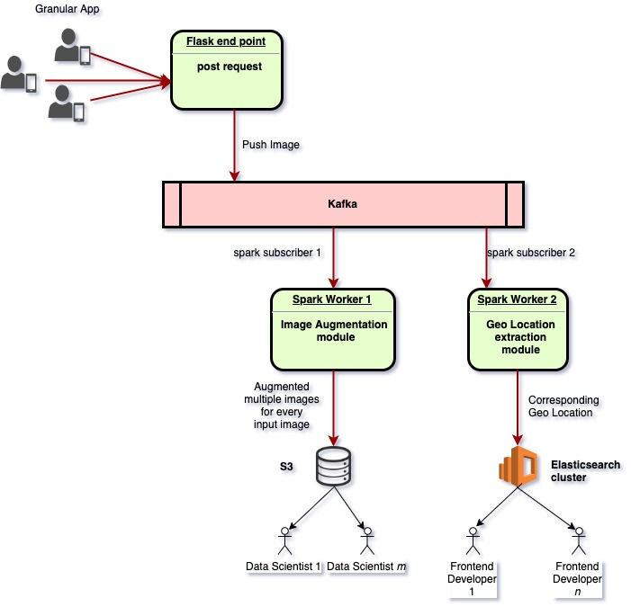

# Granular Image Processing Pipeline Interview Challenge
---
With the ubiquity of smart phones, there's a huge opportunity to allow farmers to bring data science models into the field with them. Your task for this challenge is to build a pipeline to deliver imagery to such a model. In this challenge, the model takes in an image of a field and returns the crop being grown.

## Objectives
1. Extract and format information from raw images.
2. Prepare data for ingestion by a machine learning model.
3. Create an easily reproduceable pipeline along with documenation.
4. Visualize geolocation data.

NOTE: You will *not* be building a model for this challenge, but rather the pipeline that feeds it.

## How To Submit Your Answer
Email us your code along with your written response and any plots you produce within 48 hours of receiving this challenge. (If you're stuck, feel free to email `chipfranzen@granular.ag` and ask for a small hint or clarification.) Code should be runnable, so include a requirements file with any dependencies, along with documentation for running the pipeline. The written response should be a .txt file. *Do not* include the output of your pipeline. We will run your code to produce the output ourselves.

## Data Sources
In the `img/` directory, you will find the images you should run through your pipeline. These are photos from Flickr of various fields, in jpeg format. Each subdirectory contains one class.

Note that geolocation metadata is contained in the `Exif` of each image.

## Coding Tasks
Be sure to explain your choices and provide documentation as appropriate.

1. Write an image processing pipeline. This pipeline should prepare raw jpegs for input into a machine learning model. The model is a convolutional neural network with input dimension (224, 224, 3).
2. Extend your basic pipeline with image augmentation techniques.
3. Map the locations of the images. Note that not all images include geolocation data.

## Written Task
Propose an architecture for an end-to-end machine learning application to classify fields by crop type.

Be sure to cover:
  * training data acquisition and storage
  * dataset curation
  * model development
  * moving models to production
  * serving predictions to the client

## Proposed Pipeline
Here is my proposed pipeline which has flask, kafka, spark, s3 and elasticsearch components. 

  * Flask - for RESTful service to collect images from mobile application or any other equivalent source
  * Kafka - for event driven architecture (distributed)
  * Spark - distributed data processing modules (distributed)
  * S3 - for storing augmented images, used by data scientists to train CNN models
  * Elasticsearch - for storing extracted geo location (also distributed)

## Usage
run deploy.sh, like
./deploy.sh

# Use sample api  
curl http://0.0.0.0:8000/is_alive

> expected response
> {
>   "ret_ack": "Channa works on granular data pipeline."
> }

curl -F "file=@imgs_de/alfalfa/17254133335_e3c5643574_z.jpg" http://0.0.0.0:8000/post_image

> expected response
> {
>   "ret_ack": "Success. Got your image. Thank you. <class 'PIL.JpegImagePlugin.JpegImageFile'>"
> }

## Recommended Tools
* [Imagemagick](https://www.imagemagick.org/script/index.php) for command-line image transformation.